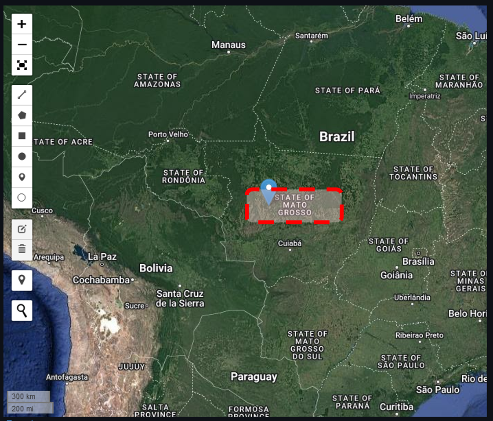
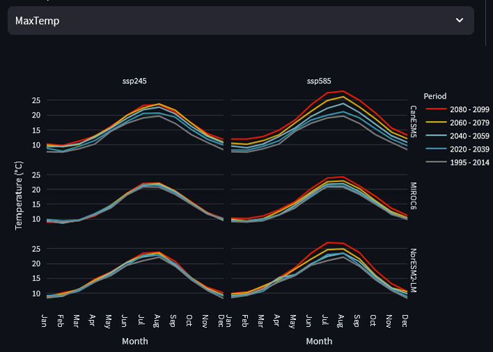
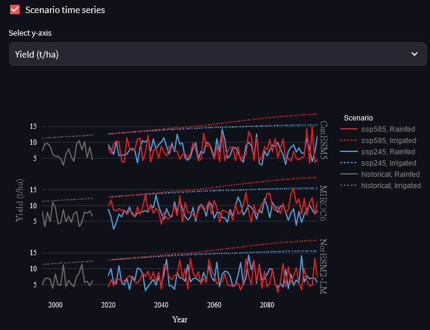
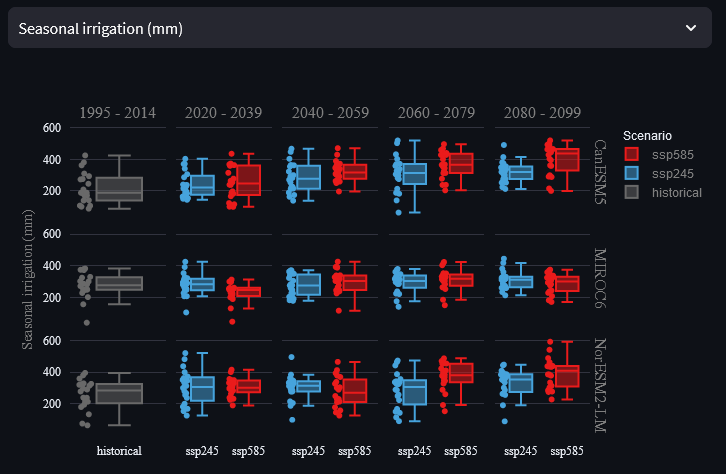
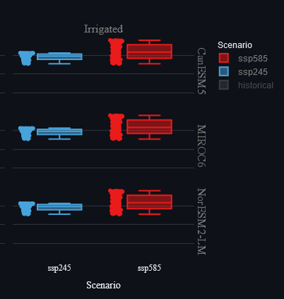

```{r setup, include=FALSE}
knitr::opts_chunk$set(echo = TRUE)
```

In previous labs, we've looked at how the value of irrigation and optimal strategies change in different areas over historical time. Today, we will consider how future climate change is projected to impact crop production risks. We will then explore how irrigation could help adaptation to future climates, how specific irrigation requirements may evolve and how these changing requirements vary across future scenarios and time periods. 

# Step 1 - Explore example data
Today, we will be using a variety of example data to demonstrate how the app works. For future reference, you are also able to upload CMIP6 data that you have downloaded yourself, so that you can assess climate change impacts for any region in the world. For this exercise, we will be looking at potato production in south-east England - select 'Woolpit, UK' from the example data drop-down menu:

\

```{r echo=FALSE, out.width='100%'}

```

\

CMIP6 is the Coupled Model Intercomparison Project phase 6 and represents an ensemble of many global climate models used to project future climate data. For our example in Woolpit, the example data that has been pre-downloaded includes data from three different CMIP6 models: CanESM5, MIROC6 and NorESM2-LM. Each model varies in the way it simulates future climate through atmospheric and oceanic processes, so it's useful to look at more than a single model when projecting future impacts.

Let's begin to explore our future climate projection data - head to the 'Explore data' tab and open the 'Info' panel. You will see that for every model in the example data, there are five time periods and two shared socio-economic pathways (SSP245 and SSP585). The first time period is 'historical' which covers 1995 to 2014 because 2015 is when projections begin. The subsequent periods cover two decades each, from 2020 up to 2099. For further information on what the different SSP scenarios represent, view the info box below.

\

:::: {.infobox .info data-latex="{info}"}
**Shared Socioeconomic Pathways (SSPs) and Representative Concentration Pathways (RCPs)**

Cover basics to give context to the multiple future scenarios they're working with.

<button class="btn btn-primary" data-toggle="collapse" data-target="#Block1"> Show/Hide Info </button>  
  <div id="Block1" class="collapse">  
    
  The direction of future economic, industrial and environmental progress is uncertain. For us to produce reasonable projections of future climate impacts, it is important to identify this uncertainty by constructing a range of possible future scenarios. In the past, Representative Concentration Pathways (RCPs) were used as the only determinant of future uncertainty, providing trajectories of the atmospheric concentration of carbon dioxide under different future development scenarios. For example, RCP8.5 represents a high-emissions scenario where the total incoming and trapped solar radiation reaches 8.5 W/m$$^2$$ by 2100. More recently, this concept has been combined with Shared Socioeconomic Pathways (SSPs) to better quantify variations caused by additional global changes such as national population, urbanisation and GDP per capita. See the chart below for a summary of the different SSP scenarios.
  
  ```{r echo=FALSE, out.width='100%'}
    knitr::include_graphics('imgs/tut_3_B.png')
  ```
  
  RCPs and SSPs are now combined, to represent different levels of carbon dioxide concentration achieved through each socioeconomic scenario. For example, SSP245 represents the SSP2 socioeconomic scenario, leading to RCP4.5, overall representing a middle-ground future scenario. Conversely, SSP585 represents fossil-fueled development leading to RCP8.5, representing an extremely high emissions scenario.

  </div>

::::

\

Now that we know what type of data we're working with, use the 'Visualize weather data' panel to answer the following questions:

\

:::: {.whitebox .question data-latex="{question}"}
**Question 1.a.**

Across all three models, how is precipitation in Woolpit generally projected to change from historic levels in the near and far future? Does this change differ between SSP scenarios? If so, why might this be?

<button class="btn btn-primary" data-toggle="collapse" data-target="#Block2"> Show/Hide Example </button>  
  <div id="Block2" class="collapse">  
  
  Broadly, precipitation is projected to increase over autumn and winter months (Nov - Jan) and reduce over summer months (Jun/Jul/Aug). The direction of these changes remains constant between SSPs, but the magnitude of changes increases from SSP245 to SSP585. This is because SSP585 represents a higher-emissions scenario where a greater degree of warming will cause more extreme shifts in climate. 
    
  ```{r echo=FALSE, out.width='100%'}
    knitr::include_graphics('imgs/tut_3_C.png')
  ```
  
  </div>

::::

:::: {.whitebox .question data-latex="{question}"}
**Question 1.b.**

How do minimum and maximum temperatures change over time across the three models? Would it be reasonable to select a single model to interpret future temperature impacts, and why?

<button class="btn btn-primary" data-toggle="collapse" data-target="#Block3"> Show/Hide Example </button>  
  <div id="Block3" class="collapse">  
  
  In general, temperatures are projected to increase over time across all three models, and is more pronounced under SSP585 than SSP245.
    
  ```{r echo=FALSE, out.width='100%'}
    
  ```
    
   Models MIROC6 and NorESM2-LM2 project much smaller increases in temperature over time than CanESM5. It would therefore not be appropriate to use a single model of these three, but instead use an ensemble measure, such as mean or median for each projected data point. The difference between the models' projections is highlighted in the zoomed view below:
   
  ```{r echo=FALSE, out.width='100%'}
    knitr::include_graphics('imgs/tut_3_E.png')
  ```
   
  
  </div>

::::

\

# Step 2 - Future climate impacts

Now that we've explored the climate projections for Woolpit, it's time to assess how they impact future potato yield. Go to the 'Run AquaCrop' tab and leave all settings at their defaults. Due to the large number of models, you will have to scroll down quite far to press the 'Run model' button. The models should take no longer than a minute or two to complete.

Once the models have run, use the 'Scenario time series' and 'Boxplot scenario comparison' graphs for 'Yield (t/ha)' to answer the following questions:

:::: {.whitebox .question data-latex="{question}"}
**Question 2.a.**

Describe the historical and projected future trends of rainfed potato yields across the three models and two scenarios. What is the difference in inter-annual variability of rainfed and irrigated yields? Why might this be? 

<button class="btn btn-primary" data-toggle="collapse" data-target="#Block4"> Show/Hide Example </button>  
  <div id="Block4" class="collapse">  
  
  Overall, there is a significant degree of inter-annual variability across all models and scenarios, making it difficult to identify any long-term increase or decrease in rainfed yield. Conversely, irrigated yields have extremely low inter-annual variability. Although such stable and reliable yields are unrealistic, they represent the twofold benefit of irrigation. Irrigated crops typically have their water requirements met throughout the growing season and can use additional water to protect against heat stress. Thus, irrigated yields are typically less variable and higher on average than rainfed yields.
    
  ```{r echo=FALSE, out.width='100%'}
    
  ```
  
  </div>

::::

:::: {.whitebox .question data-latex="{question}"}
**Question 2.b.**

In the 'Scenario time series' panel, isolate the rainfed yields under SSP245. Imagine you are looking to produce a single yield projection per year, using data from all three models. By comparing the results across the three models, explain why the median is a more suitable summary measure than the mean?

<button class="btn btn-primary" data-toggle="collapse" data-target="#Block5"> Show/Hide Example </button>  
  <div id="Block5" class="collapse">  
  
  In general, it's useful to use the median value from a model ensemble because the median represents a model-predicted value whereas the mean is not directly produced by any single model. Specifically, this rainfed plot shows a large range of inter-annual variation that is often not *in phase* between models. If we were to use the mean of each year, then it is likely that a large degree of this inter-annual variation would be removed through averaging. Thus, to create a representative average of these three models, selecting the 'middle' model value for each year would be best - because it both represents a real model output, and retains more variability than the mean.
    
  ```{r echo=FALSE, out.width='100%'}
    
  ```
  
  </div>

::::

:::: {.whitebox .question data-latex="{question}"}
**Question 2.c.**

Using the 'Scenario time series', what do you notice about the projected irrigated potato yields under SSP245 and SSP585? Does this match your expectations? What is a potential explanation for this notable difference?

<button class="btn btn-primary" data-toggle="collapse" data-target="#Block6"> Show/Hide Example </button>  
  <div id="Block6" class="collapse">  
  
  We saw earlier that SSP585 has a greater magnitude of changes in precipitation and greater increases in both minimum and maximum temperatures. You could reasonably expect increases in heat stress and irrigation water requirements to reduce irrigated yields. However, we can see clearly in the plot below that irrigated yield is projected to have a greater increase under SSP585 than SSP245. Specifically, this is likely caused by the increasing temperatures benefitting crop growth. Crop yield can benefit from higher temperatures when there is sufficient crop water availability from irrigation. The crop can use evapotranspiration to maintain safe leaf temperatures whilst maximising growth and therefore yield.
    
  ```{r echo=FALSE, out.width='100%'}
  
  ```
  
  </div>

::::
<!-- By looking at the boxplot alone, you may think that SSP585 irrigated yield has a greater degree of inter-annual variability than SSP245. However, this is a representation of a greater increase in yield for SSP585 than SSP245 over a long time period (2020-2099).  -->
