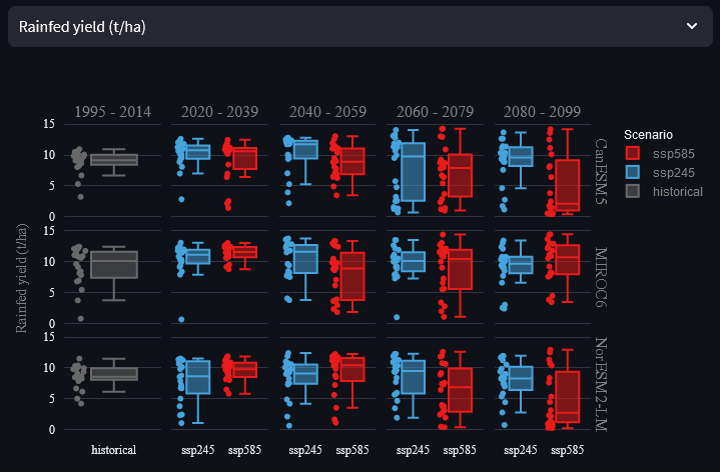
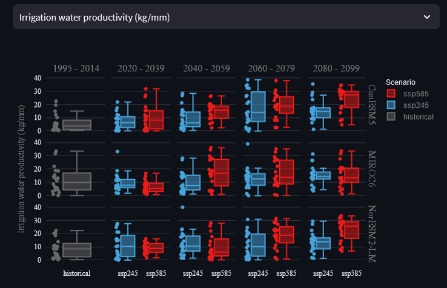

```{r setup, include=FALSE}
knitr::opts_chunk$set(echo = TRUE)
```

\

Climate change is leading to warmer temperatures and more variable rainfall patterns around the world. Understanding how changes in temperature, rainfall, and evaporative demands will impact crop production is crucial for designing strategies to make agriculture more resilient to climate change, and for ensuring that agricultural adaptation (e.g., greater use of irrigation) does not negatively impact the environment or other aspects of society. In this exercise, you will use AquaPlan to explore how climate change will impact crop production, and how changes in production risks vary across different future climate projections, for an example case study of potato production in eastern England. You will then explore strategies to sustainably adapt potato production to future changes in climate in eastern England, with a specific focus on use of irrigation to mitigate against drought risks. 

\

# Step 1 - Explore future climate projections

## Select site

In this exercise, you will be using a variety of pre-processed climate data to conduct assessments of climate change impacts. First, select 'Woolpit, UK' from the example data drop-down menu. For future reference, you are also able to upload climate change projection data that you have downloaded and pre-processed yourself, so that you can assess climate change impacts for any region in the world. A CMIP6 data downloader tool is also provided with AquaPlan to assist with this process. 

\

```{r echo=FALSE, out.width='100%'}
knitr::include_graphics('imgs/tut_3_A.png')
```

\

After making the selection in the drop-down menu, a series of future climate data files will be loaded into the app for a site near Woolpit in Suffolk, eastern England. Climate change projections are drawn from the CMIP6 (Coupled Model Intercomparison Project phase 6). Pre-processed data files in the format required by AquaPlan are provided for a selection of different CMIP climate models (CanESM5, MIROC6 and NorESM2-LM), two alternate scenarios for future emissions trajectories (Shared Socio-economic Pathways or SSP's - SSP245 and SSP585), and five time periods ('historical' - 1995 to 2014, 2020-2039, 2040-2059, 2060-2079, 2080-2099). Further information about the different SSP scenarios represent is given in the info box below.

\

:::: {.infobox .info data-latex="{info}"}
**Shared Socioeconomic Pathways (SSPs) and Representative Concentration Pathways (RCPs)**

<button class="btn btn-primary" data-toggle="collapse" data-target="#Block1"> Show/Hide Info </button>  
  <div id="Block1" class="collapse">  
  
  \
    
  The direction of future economic, industrial and environmental progress is uncertain. For us to produce reasonable projections of future climate impacts, it is important to identify this uncertainty by constructing a range of possible future scenarios. In the past, Representative Concentration Pathways (RCPs) were used as the only determinant of future uncertainty, providing trajectories of the atmospheric concentration of carbon dioxide under different future development scenarios. For example, RCP8.5 represents a high-emissions scenario where the total incoming and trapped solar radiation reaches 8.5 W/m^2^ by 2100. More recently, this concept has been combined with Shared Socioeconomic Pathways (SSPs) to better quantify variations caused by additional global changes such as national population, urbanisation and GDP per capita. See the chart below for a summary of the different SSP scenarios.
  
  \
  
  ```{r echo=FALSE, out.width='100%'}
    knitr::include_graphics('imgs/tut_3_B.png')
  ```
  
  \
  
  RCPs and SSPs are now combined, to represent different levels of carbon dioxide concentration achieved through each socioeconomic scenario. For example, SSP245 represents the SSP2 socioeconomic scenario, leading to RCP4.5, overall representing a middle-ground future scenario. Conversely, SSP585 represents fossil-fueled development leading to RCP8.5, representing an extremely high emissions scenario.

  </div>

::::

\

## Visualise climate projections

Now that you have loaded the relevant climate data files into AquaPlan and learnt more about what they represent, use the 'Visualize weather data' panel to answer the following questions:

:::: {.whitebox .question data-latex="{question}"}
**Question 1.a.**

How do minimum and maximum temperatures change over time across the three models and two alternate SSPs? Would it be reasonable to select a single model to interpret future temperature impacts, and why?

<button class="btn btn-primary" data-toggle="collapse" data-target="#Block2"> Show/Hide Example </button>  
  <div id="Block2" class="collapse">  
  
  \
  
  In general, both maximum and minimum temperatures are projected to increase over time across all three models, with the largest absolute increases in temperatures during the summer months. Increases in temperatures are most p and is more pronounced under SSP585 than SSP245.
  
  \
    
  ```{r echo=FALSE, out.width='100%'}
    knitr::include_graphics('imgs/tut_3_D.png')
  ```
  \
  
  ```{r echo=FALSE, out.width='100%'}
    knitr::include_graphics('imgs/tut_3_D2.png')
  ```
  
  \
    
   There are noticeable differences in how temperatures are projected to change when comparing between the three selected climate models. The MIROC6 and NorESM2-LM2 models both project much smaller increases in minimum and maximum temperatures over time than CanESM5. The difference between the models' projections is highlighted in the zoomed view below for maximum temperatures. These differences highlight the importance of using multiple models when assessing potential impacts of future climate change on agriculture, in particular given that crops may have highly non-linear responses to climate changes (e.g., rapid increase in crop damage if temperature thresholds are exceeded).
   
   \
   
  ```{r echo=FALSE, out.width='100%'}
    knitr::include_graphics('imgs/tut_3_E.png')
  ```
   
  
  </div>

::::

\

:::: {.whitebox .question data-latex="{question}"}
**Question 1.b.**

How is precipitation in Woolpit projected to change from historic levels in the near and far future? Does this change differ between SSP scenarios or models? If so, why might this be?

<button class="btn btn-primary" data-toggle="collapse" data-target="#Block3"> Show/Hide Example </button>  
  <div id="Block3" class="collapse">  
  
  \
  
  Broadly, precipitation is projected to increase over autumn and winter months (Nov - Jan) and reduce over summer months (Jun/Jul/Aug). The direction of these changes is the same for both SSPs, but the magnitude of changes increases from SSP245 to SSP585. This is because SSP585 represents a higher-emissions scenario where a greater degree of warming will be likely to cause more extreme shifts in climate, including greater seasonal variations and volatility in precipitation.   
  
  \
    
  ```{r echo=FALSE, out.width='100%'}
    knitr::include_graphics('imgs/tut_3_C.png')
  ```
  
  </div>

::::

\

# Step 2 - Assess climate impacts on yields

## Setup and run model
Now that you have explored the climate projections for Woolpit, it's time to use these data to assess how climate change may impact future potato yield. Go to the 'Run AquaCrop' tab and leave all settings at their defaults. You will need to scroll down past the list of models to press the 'Run model' button to execute the batch of simulations. The full set of simulations should take no longer than a couple minutes to complete depending on the speed of your machine or the web server. 

\

## Explore yield projections
Once the models have run, use the 'Scenario time series' and 'Boxplot scenario comparison' graphs for 'Yield (t/ha)' to answer the following questions:

:::: {.whitebox .question data-latex="{question}"}
**Question 2.a.**

On average, how are rainfed potato yields across the three models and two SSP scenarios? How may climate change affect the inter-annual variability of rainfed yields? 

<button class="btn btn-primary" data-toggle="collapse" data-target="#Block4"> Show/Hide Example </button>  
  <div id="Block4" class="collapse">  
  
  \
  
  Median rainfed crop yields vary significantly across the different time periods, SSP's, and climate models. In general, median yields increase under SSP245 in the near to medium term future (i.e. 2020-2039 and 2040-2059) for all three models. Median yields then decline for SSP245 in later time periods, in some cases dropping slightly below the levels achieved during the historic period (e.g., NorESM2-LM model in 2080-2099). In contrast, median yields under SSP585 typically decline earlier and by greater magnitudes than for SSP245. For example, median yields averaged across the three models for SSP585 in 2080-2099 are 5.2 t/ha, compared with 9.2 t/ha for SSP245 in 2080-2099 and 9.3 t/ha in the historical period. 
  
  \
    
  ```{r echo=FALSE, out.width='100%'}
    
  ```
  
  \
  
From the figure above, it is noticeable that - especially under SSP585 - there is a dramtic increase in inter-annual volatility of rainfed potato yields (represented by the spread of the boxplots). This is driven by reductions in precipitation during the summer growing season and increased incidences of extreme high temperatures that damage potato growth and yield formation. These changes are most pronounced for later time periods and for the CanESM5 and NorESM2-LM models, which both project larger changes in precipitation and temperatures during the summer months than the MIROC6 model.   

  
  </div>

::::

:::: {.whitebox .question data-latex="{question}"}
**Question 2.b.**

Are the impacts of climate change on irrigated yields the same as rainfed yields? What do the differences you observe suggest about the main drivers of future production risks?

<button class="btn btn-primary" data-toggle="collapse" data-target="#Block5"> Show/Hide Example </button>  
  <div id="Block5" class="collapse">  
  
  \
  
  Previously, we saw that rainfed potato yields were expected to become much more volatile, and ultimately decline on average in the long-term future especially under more extreme climate change projections (e.g. SSP585). In contrast, the figures below shown irrigated yields - both individually and expressed as the difference between irrigated and rainfed yields. These figures show that irrigated potato yields are projected to increase over time, with the largest increases in median yields occurring in 2080-2099 and for SSP585. Variability in irrigated potato yields is also much smaller than for rainfed yields, with irrigation providing a premium of over 10 t/ha in some years by 2080-2099 under SSP585 for all three models.   
  
  \
  
  ```{r echo=FALSE, out.width='100%'}
  knitr::include_graphics('imgs/tut_3_J.png')
  ```
  
  \
    
  ```{r echo=FALSE, out.width='100%'}
  knitr::include_graphics('imgs/tut_3_I.png')
  ```
  
  \
 
  We saw earlier that climate change is projected to lead to both lower precipitation and higher minimum and maximum temperatures during the potato growing season. Under these conditions, irrigation provides big yield benefits for farmers by enabling them to protect their potato crop against rainfall deficits while at the same time exploiting the positive effects of increased temperatures and CO2 fertilisation for crop growth and development of harvestable yield. It is important to note that these results suggest that temperatures in Woolpit are not projected to regularly exceed critical thresholds for damaging potatoes under any future climate change scenario simulated. However, if temperatures were to exceed critical thresholds then this would negatively affect both irrigated and rainfed yields.
  
  </div>

::::

\

# Step 3 - Evaluate sustainability of irrigation

The previous step demonstrated the potential benefits of irrigation as a means of adapting to climate change for potato production at the site in Woolpit, eastern England. However, eastern England is also a region where water resources are becoming increasingly scarce, and there is growing competition for water between domestic users, industry, the environment, and agriculture during dry summer months. Understanding the water requirements of irrigation under different future climate change projections is therefore important to determine how agricultural water demands may impact other users and ecosystems, and to develop strategies for fair and sustainable use of limited freshwater resources. 

In this context, use the 'Water use comparison' figures to explore how irrigation water demands for potato production will evolve under different future climate projections and answer the questions below:

:::: {.whitebox .question data-latex="{question}"}
**Question 3.a.**

How is irrigation water use projected to change across the three models and two SSP scenarios? Will peak levels of water use likely be higher/lower/same compared to historic under future climate change?

<button class="btn btn-primary" data-toggle="collapse" data-target="#Block6"> Show/Hide Example </button>  
  <div id="Block6" class="collapse">  
  
  \
  
  Irrigation water use is generally projected to increase as we project further into the future and for more extreme emissions scenarios. For example, median annual irrigation water use, averaged across the three climate models, is 278 mm under SSP585 for the period 2080-2099, compared to 186 mm under SSP245 for the period 2020-2039 - a difference of almost 50\%. Irrigation water use typically is highest for CanESM5 and NorESM2-LM models under both SSP's, reflecting the fact that these models predict lower precipitation and higher temperatures (the latter of which directly correlates to crop evapotranspiration demands).
  
  \
    
  ```{r echo=FALSE, out.width='100%'}
  knitr::include_graphics('imgs/tut_3_G.png')
  ```
  
  \
  
  Under almost all combinations of models, scenarios, and future time periods, the peak annual irrigation water use per year is projected to be higher due to climate change than in the historic period. For water management, this is important as elevated peak water demands will usually occur during drought years when demands from other users will also be high, increasing risks of conflict between users or damage to freshwater-dependent ecosystems.
  
  </div>

::::

:::: {.whitebox .question data-latex="{question}"}
**Question 3.b.**

How do changes in irrigation water use and crop yields combine to influence the productivity of water use in potato production? How might farmers improve productivity of water use further?

<button class="btn btn-primary" data-toggle="collapse" data-target="#Block7"> Show/Hide Example </button>  
  <div id="Block7" class="collapse">  
  
  \
  
  The productivity of irrigation water use - expressed as the difference between irrigated and rainfed potato yields in kilograms divided by the number of millimeters of applied irrigation - is generally increasing under climate change. Largest gains are found for later time periods and more extreme SSP scenarios. When comparing across models, irrigation water productivity and the CanESM5 and NorESM2-LM models compared to the MIROC6 model. This reflects the fact that these models typically produce the largest yield differentials between irrigated and rainfed production, whereas changes in irrigation water use show lower variations across the three models.
  
  \
  
  ```{r echo=FALSE, out.width='100%'}
  
  ```
  
  \
  
  One of the ways through which a farmer could improve their water productivity further is by changing irrigation management practices. For example, by improving irrigation efficiency or changing the level of soil moisture at which irrigation is triggered so as to avoid crop water stress but minimise losses of water that do not benefit the crop such as soil evaporation or deep percolation. In doing so, a farmer could limit water use increases while at the same time maintaining most of the observed yield benefits from climate change. However, it is important to note that, while measures may help to limit future increases in irrigation application rates, they may be less effective at reducing the consumptive water use (i.e. evapotranspiration) of the crop which depends primarily on the length of the growing season and weather conditions. 
  
  </div>

::::


