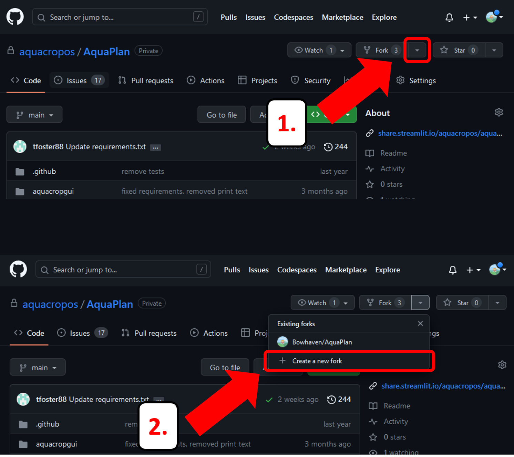

```{r setup, include=FALSE}
knitr::opts_chunk$set(echo = TRUE)
```

\

# Running on a browser

Some test changes here

The AquaPlan app is hosted online for your convenience, using Streamlit's Community Cloud server. The app can be accessed and run using any standard web browser (Chrome, Firefox, Safari, Edge) by clicking the Launch App tab on the top menu bar of this page or by navigating manually to \url{https://www.tinyurl.com/aquaplan} in the browser. 

As Streamlit's Community Cloud server only provides a limited amount of compute power, it is possible that you may experience minor delays or error messages in the event that large numbers of users are accessing the app simultaneously. In these cases, it may be necessary to reboot the app or to wait for more bandwith to free up. For a list of common error messages and associated solutions, please refer to the FAQ section on the top menu bar of this page. 

\

# Local installation
 
For prolonged or intensive usage, you will find it easier to create a locally-hosted instance of AquaPlan. The following steps describe how to host AquaPlan locally on your machine, assuming no prior knowledge of hosting or cloning repositories. 

The AquaPlan repository ('repo') is currently private, so you will need to gain access before continuing with this guide.

\

## Create fork 

We begin by creating a fork from the main AquaPlan repo. By forking the repo, we copy its contents into a duplicate repo. This acts as a safety measure to prevent unchecked changes accidentally being made to the main repo, which is currently used to generate the live web-app.

To create a fork, navigate to the AquaPlan repo, locate the 'Fork' drop-down menu (shown below) and select 'Create a new fork'. Then, follow the dialogue prompts to choose a location for your fork.

\

```{r echo=FALSE, out.width='100%'}

```

\

## Clone fork to local machine

Next, we clone (i.e. 'copy') the forked repo from the previous step onto your local machine. First, copy the HTTPS link from your repo as shown in the images below:

\

```{r echo=FALSE, out.width='100%'}
knitr::include_graphics('imgs/tut_0_B.png')
```

\

Then, create an empty folder on your machine where you would like to store the AquaPlan app. Open your IDE of choice (e.g. Visual Studio Code) and set the empty folder you just created as your working directory. Start a terminal and enter the following command to clone your repo, replacing **your-repo-url-here** with the URL you copied from GitHub previously.  

```{bash eval=FALSE}
git clone your-repo-url-here
```

The repo will now be cloned into your new folder. 

\

## Create 'conda' environment

Next, we need to load all of the packages required to run AquaPlan. Here, we use 'conda' to install all of our required packages. In the same terminal as before, enter the following command to create a new, blank 'conda' environment using Python version 3.9 (you can replace "environment-name" with any name).

```{bash eval=FALSE}
conda create -n "environment-name" python=3.9
```

Once the environment is created, we then need to activate it using the following command to begin working within the 'conda' environment:

```{bash eval=FALSE}
conda activate environment-name
```

\


## Install required packages

All of the required packages and their versions are contained within the file **"requirements.txt"** in the AquaPlan repo. This makes installation straightforward, though it may take some time on the first run. Simply enter the following command into the terminal:

```{bash eval=FALSE}
pip install -r requirements.txt
```


\

## Run app locally

Now that everything is set up, all that is left to do is run the app. The following command will launch the AquaPlan app in your default browser, and assumes that your terminal working directory is the 'AquaPlan' directory of the repo:

```{bash eval=FALSE}
streamlit run aquacropgui/01_🏠_Home.py
```

**N.B.** Because the path contains an emoji, you will have to type the command up to **/01_** and then press the 'Tab' key to autocomplete the path.

