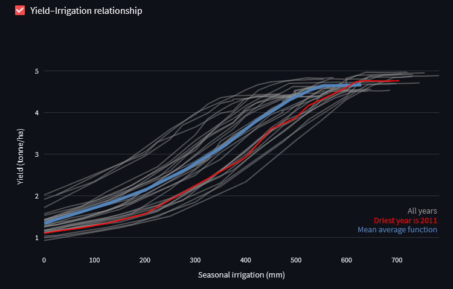

```{r setup, include=FALSE}
knitr::opts_chunk$set(echo = TRUE)
```

Agriculture is the largest sectoral user of water globally. Identifying ways to use water productively and efficiently in agriculture is therefore crucial to support sustainable management of scarce water resources. In this exercise, you will use the AquaPlan app to explore how farmers can optimise irrigation management to maximise returns from limited available water resources focusing on an example of irrigation soybean production in Brazil. You will use AquaPlan to develop crop-water production functions that show how crop yields vary as a function of different levels of irrigation water use. Using this information, you will explore how AquaPlan can be used to identify optimum irrigation management rules for different objectives and constraints, and how best irrigation management practices vary across different climatic conditions.

\

# Step 1 - Develop production function
## Select site
For this exercise, all activities will focus on the same example case study - irrigated soybean production in Mato Grosso ("great woods") state in the Amazonian region of central Brazil. First, launch AquaPlan ('Launch App' button at the top-right of this page) and navigate to the 'Crop-water production function' tab. Then, enter the following coordinates (-13.249141, -57.983966) in the search box to select an example field in Mato Grosso state in Brazil as shown on the map below. AquaPlan will automatically retrieve weather information for the site from the NASA Power dataset along with soil properties from the global SoilGrids dataset produced by the International Soil Reference and Information Centre (ISRIC).

```{r echo=FALSE, out.width='100%'}
knitr::include_graphics('imgs/tut_2_A.png')
```

\

## Setup and run AquaCrop
Select the 'Run AquaCrop' tab and browse through all of the model parameters that can be tweaked. First, set the crop type to Soybean. Then select the 'Economics' tab, and change the values of crop price, water cost, and production cost to \$400 per tonne, $0.5 per ha-mm, and \$700 per ha respectively. Leave all other parameters at their default values, but note the different options that can be changed under the 'Irrigation' tab. This includes the application efficiency of irrigation, as well as the soil moisture target levels used to trigger irrigation. AquaPlan will run for all potential soil moisture target levels between the maximum and minimum values selected, with the number of unique targets between these upper and lower bounds controlled by the selected increment. 

\

```{r echo=FALSE, out.width='100%'}

```

\

## Interpret outputs
Navigate to the 'Visualize outputs' tab, and use the checkboxes to explore the outputs of the AquaPlan simulations for the site in Mato Grosso. Using the Yield-Irrigation figure and data to explore the simulated crop-water production functions, and answer the following questions:

\

:::: {.whitebox .question data-latex="{question}"}
**Question 1.a.**

Does the same amount of irrigation result in the same amount of yield each year? Use your knowledge about crop water requirements and climate variability to explain your answer.

<button class="btn btn-primary" data-toggle="collapse" data-target="#Block1"> Show/Hide Example </button>  
  <div id="Block1" class="collapse">  
  
  The same amount of irrigation (e.g. 350 mm, red line) results in a wide range of yields each year (2.0 to 4.3 t/ha, green lines). The water requirements of the soybean crop are met through a combination of rainfall and irrigation. As shown in the figure below, rainfall varies a lot from one year to another in the study area. As a result, a fixed amount of irrigation my be sufficient to fully meet crop water needs in some years but be insufficient in other years, potentially resulting in crop stress and yield reductions. 
  
  ```{r echo=FALSE, out.width='100%'}
knitr::include_graphics('imgs/tut_2_B.png')
  ```
  
  </div>

::::

\

:::: {.whitebox .question data-latex="{question}"}
**Question 1.b.**

Irrigation is generally seen as a way to increase crop yields. Does higher irrigation always result in higher yield? For instance, does an increase of 100 mm irrigation always result in the same amount of yield increase? Explain your answers using information from the graph.

<button class="btn btn-primary" data-toggle="collapse" data-target="#Block2"> Show/Hide Example </button>  
  <div id="Block2" class="collapse">  
  
  Irrigation helps a farmer to meet their crop's water requirements when there is insufficient rainfall prior or during the growing season. However, if the local rainfall is sufficient for meeting the crop's requirement, then irrigation will have no additional benefit to yield. This can be seen in the crop-water production functions for individual years (grey lines) shown in the figure below. For example, as irrigation increases from 400 mm to 500 mm, soybean yields continue to increase in some years but have a flat response (no yield change) in other years where the crop's water needs have already been fully satisified. 
  
  
  ```{r echo=FALSE, out.width='100%'}

  ```
  
  </div>

::::

\

# Step 2 - Identify optimal management practices
One of the main uses of crop-water production functions is to assess the value of alternative irrigation management decisions that can be made by a farmer. For example, crop-water production functions can be used to determine the optimal amount of irrigation water use - and associated management rules - for a given farmer and production system. The definition of 'optimal' will also vary depending on the objective of the farmer, for example when comparing goals of optimising profits or yields from irrigation water inputs. Using the outputs for the site in Mato Grosso, complete the following questions to explore how the crop-water production simulated by AquaPlan can be used to guide and inform efficient use of water by farmers.

\

:::: {.whitebox .question data-latex="{question}"}
**Question 2.a.**

Imagine a farmer wants to select the irrigation amount that maximises yield. Using the average production function over all years, what irrigation amount would this be? What is associated irrigation strategy (i.e. soil moisture target)? 

<button class="btn btn-primary" data-toggle="collapse" data-target="#Block3"> Show/Hide Example </button>  
  <div id="Block3" class="collapse">  
  
  Based on the average crop-water production function averaged over all historic simulated years, the optimum irrigation amount to maximise yield would be 620 mm. Using the Yield-SMT relationship figure, we can see that this is associated with a soil moisture target (SMT) strategy of 70 \% during the growing season.
  
  ```{r echo=FALSE, out.width='100%'}

  ```
  
  </div>

::::

\

:::: {.whitebox .question data-latex="{question}"}
**Question 2.b.**

Maximising economic returns to water is also an important goal for many farmers and water managers. Given the specified cost of water, crop price and fixed production costs for your soybean case study, what would be the level of irrigation that the farmer should pick in order to maximise profits (averaged over all years)?. Is this irrigation amount higher or lower than the amount that maximises yield, and why might that be?

<button class="btn btn-primary" data-toggle="collapse" data-target="#Block4"> Show/Hide Example </button>  
  <div id="Block4" class="collapse">  
  
  Seasonal irrigation of 550 mm is the optimum value to maximise profits and would be acheived by lowering the farmer's SMT irrigation strategy to 55\%. The profit-maximising amount of irrigation is lower than the amount that maximises yield. This difference is explained by the shape of the crop-water production function. As seen in Section 1 of this tutorial, yield returns to irrigation diminish beyond the point that the majority of crop's water requirements have been satisified. However, the cost of each additional unit of irrigation remains the same. As a result, it may be optimal for the farmer to not use additional irrigation if the costs exceed the yield benefits, resulting in a profit-maximising level of water use than is less than that for a goal of yield maximisation.
  
  ```{r echo=FALSE, out.width='100%'}
knitr::include_graphics('imgs/tut_2_E.png')
  ```
  
  </div>

::::

\

<!-- :::: {.whitebox .question data-latex="{question}"} -->
<!-- **Question 2.c.** -->

<!-- How do profit and yield maximising levels of water use compare to those that maximise water productivity (i.e. yield per mm of irrigation)? What does this suggest about the relationship between goals of maximising water productivity (i.e. 'more crop per drop') and farm-level economic or productivity goals?  -->

<!-- <button class="btn btn-primary" data-toggle="collapse" data-target="#Block5"> Show/Hide Example </button>   -->
<!--   <div id="Block5" class="collapse">   -->

<!-- <!-- Not sure why Water productivity graphs don't represent the gradient of yield/irri graphs, -->
<!-- would assume that section of steepest gradient represents highest water productivity --> -->

<!-- <!--   ```{r echo=FALSE, out.width='100%'} --> 
<!-- <!-- knitr::include_graphics('imgs/tut_2_F.png') --> 
<!-- <!--   ``` --> 

<!--   </div> -->

<!-- :::: -->

<!-- \ -->

# Step 3 - Assess effects of climate variability
As highlighted in the previous tutorial on the value of irrigation, in many parts of the world irrigation is used to supplement rainfall. Irrigation requirements therefore vary from one year to another depending on growing season weather conditions, which may affect a farmer's optimal irrigation management rules and choices. To explore the effects of year to year climate variability in more detail, check the box next to 'Aggregated stats' on the 'Visualize outputs' tab. Using this data and the other figures generated by AquaPlan for the Mato Grosso site, answer the following questions:

\

<!-- :::: {.whitebox .question data-latex="{question}"} -->
<!-- **Question 3.a.** -->

<!-- Do the crop-water production functions for each individual year (grey lines) follow the same shape as the mean production function (blue line)? Why might the shape of production function (in terms of yield) differ from one year to another?  -->

<!-- <button class="btn btn-primary" data-toggle="collapse" data-target="#Block6"> Show/Hide Example </button>   -->
<!--   <div id="Block6" class="collapse">   -->

<!--   Broadly, each year follows the same general trend of the mean production function - a sinusoidal shape ending at an asymptote. However, the shape does vary, as highlighted by the years highlighted in red and black below. For instance, the red line highlights a year in which greater irrigation (up to 200 mm) resulted in linearly greater yield. This represents the variability of rainfall in contributing to crop water demand each year, where an equivalent increase in irrigation will have different impacts depending on current amount of irrigation.  -->

<!--   ```{r echo=FALSE, out.width='100%'} -->
<!--  -->
<!--   ``` -->

<!--   </div> -->

<!-- :::: -->

<!-- \ -->
\

:::: {.whitebox .question data-latex="{question}"}
**Question 3.a.**

Which years have the highest and lowest rainfall during the growing season? How does the economically optimal level of irrigation water use in these years differ compared to the average over all years obtained in the previous part of this tutorial?

<button class="btn btn-primary" data-toggle="collapse" data-target="#Block7"> Show/Hide Example </button>  
  <div id="Block7" class="collapse"> 
  
  2011 has the lowest rainfall, whereas the highest rainfall was during the XXXX season. The economically optimal levels of irrigation are around 620 mm and XXX mm in 2011 and XXXX, respectively. These values differ substantially from the optimal average irrigation depth of 550 mm over all years that we found earlier. This highlights that optimal irrigation requirements vary from year to year as a result of different levels of rainfall during the growing season, which affect the amount of supplemental irrigation needed to avoid crop stress and yield losses.
  
  ```{r echo=FALSE, out.width='100%'}

  ```
  
  </div>

::::

\

:::: {.whitebox .question data-latex="{question}"}
**Question 3.b.**

What are the associated economically optimal soil moisture target strategy  for the wettest and driest years? How does this differ from the optimal SMT strategy averaged over all years?

<button class="btn btn-primary" data-toggle="collapse" data-target="#Block8"> Show/Hide Example </button>  
  <div id="Block8" class="collapse"> 
  
  INSERT ANSWER
  
<!--   ```{r echo=FALSE, out.width='100%'} -->
<!-- knitr::include_graphics('imgs/tut_2_I.png') -->
<!--   ``` -->
  
  </div>

::::

\

Return to the 'Run AquaCrop' tab and change the cost of water \$1.00 per ha-mm to simulate a scenario where there is both high demand and low availability of water in a drought year leading to an increase in water prices

\

:::: {.whitebox .question data-latex="{question}"}
**Question 3.c.**

How does this change in water price affect the overall profits and the optimal amount of irrigation? What would be the impact if crop prices were also increased by the same proportion (i.e. by 100\% from \$400 per tonne to $800 per tonne)?

<button class="btn btn-primary" data-toggle="collapse" data-target="#Block8"> Show/Hide Example </button>  
  <div id="Block8" class="collapse"> 
  
  Increasing the water price does not affect economically optimal amount of irrigation, but does decrease overall profits and increases the penalty for irrigating beyond an optimal amount.
  
  Doubling the crop prices more than quadruples the overall profit from an optimum irrigation amount. 
  
  ```{r echo=FALSE, out.width='100%'}
knitr::include_graphics('imgs/tut_2_I.png')
  ```
  
  </div>

::::

