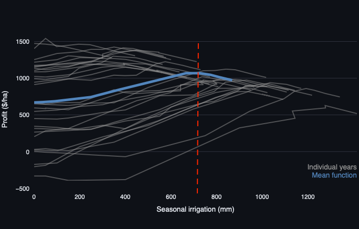
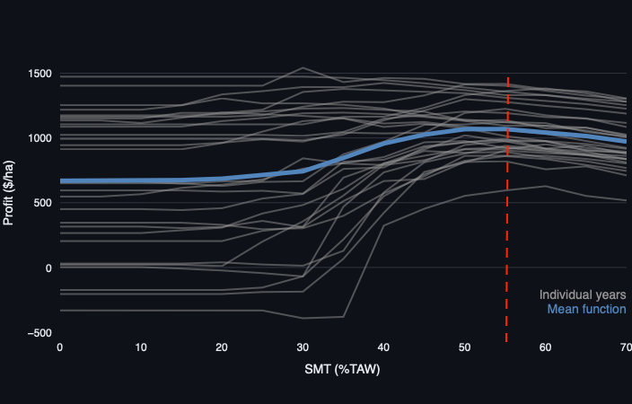
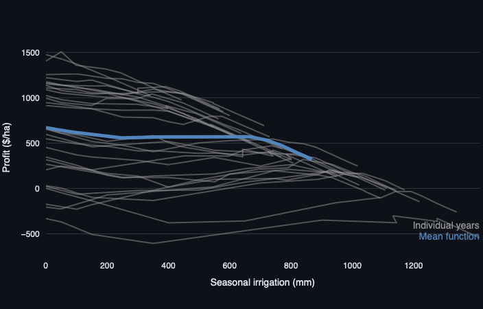

```{r setup, include=FALSE}
knitr::opts_chunk$set(echo = TRUE)
```

Agriculture is the largest sectoral user of water globally. Identifying ways to use water productively and efficiently in agriculture is therefore crucial to support sustainable management of scarce water resources. In this exercise, you will use the AquaPlan app to explore how farmers can optimise irrigation management to maximise returns from limited available water resources focusing on an example of irrigation soybean production in Brazil. You will use AquaPlan to develop crop-water production functions that show how crop yields vary as a function of different levels of irrigation water use. Using this information, you will explore how AquaPlan can be used to identify optimum irrigation management rules for different objectives and constraints, and how best irrigation management practices vary across different climatic conditions.

\

# Step 1 - Develop production function
## Select site
For this exercise, all activities will focus on the same example case study - soybean production in central Argentina in South America. First, launch AquaPlan ('Launch App' button at the top-right of this page) and navigate to the 'Crop-water production function' tab. Then, enter the following coordinates (-32.573, -63.7726) in the search box to select an example field in the province of Cordoba, Argentina as shown on the map below. AquaPlan will automatically retrieve weather information for the site from the NASA Power dataset along with soil properties from the global SoilGrids dataset produced by the International Soil Reference and Information Centre (ISRIC).

```{r echo=FALSE, out.width='100%'}

```

\

## Setup and run AquaCrop
Select the 'Run AquaCrop' tab and browse through all of the model parameters that can be tweaked. First, set the crop type to Soybean and change the planting date to 1 November to match the typical start of the main soybean season in Argentina. Select the 'Water Content' tab and change the initial soil water content to 50\% of total available water, reflecting that soybean production starts at end of the prior dry season. Next, select the 'Irrigation' tab and change parameters to match a typical furrow irrigation system as follows leaving all parameters at their default values: (i) maximum irrigation depth = 50 mm/ha/day; and (ii) application efficiency = 50\%. Finally, select the 'Economics' tab, and change the values of crop price, water cost, and production cost to \$500 per tonne, $0.75 per ha-mm, and \$700 per ha respectively. Once these chages are completed, select 'Run Model' and AquaPlan will run for all selected years and potential soil moisture target levels between the maximum and minimum values selected, with the number of unique targets between these upper and lower bounds controlled by the selected increment. 

## Interpret outputs
Navigate to the 'Visualize outputs' tab, and use the checkboxes to explore the outputs of the AquaPlan simulations for the site in Cordoba province. Using the Yield-Irrigation figure and data to explore the simulated crop-water production functions, and answer the following questions:

\

:::: {.whitebox .question data-latex="{question}"}
**Question 1.a.**

Does the same amount of irrigation result in the same amount of yield each year? Use your knowledge about crop water requirements and climate variability to explain your answer.

<button class="btn btn-primary" data-toggle="collapse" data-target="#Block1"> Show/Hide Example </button>  
  <div id="Block1" class="collapse">  
  
  The same amount of irrigation results in a wide range of yields each year. For example, a seasonal irrigation depth of 400mm produces an average yield of approximately 3.7 t/ha but yields range from around 1.4 t/ha to 4.8 t/ha in individual years. 
  
  ```{r echo=FALSE, out.width='100%'}

  ```

The water requirements of the soybean crop are met through a combination of rainfall and irrigation. However, as shown in the figure below, rainfall varies a lot from one year to another in the study area. As a result, a fixed amount of irrigation my be sufficient to fully meet crop water needs in some years but be insufficient in other years, potentially resulting in crop stress and yield reductions. 

  ```{r echo=FALSE, out.width='100%'}

  ```
  
  </div>

::::

\

:::: {.whitebox .question data-latex="{question}"}
**Question 1.b.**

Irrigation is generally seen as a way to increase crop yields. Does higher irrigation always result in higher yield? For instance, does an increase of 100 mm irrigation always result in the same amount of yield increase? Explain your answers using information from the graph.

<button class="btn btn-primary" data-toggle="collapse" data-target="#Block2"> Show/Hide Example </button>  
  <div id="Block2" class="collapse">  
  
  Irrigation helps a farmer to meet their crop's water requirements when there is insufficient rainfall prior to and/or during the growing season. However, if local rainfall is sufficient to meet the crop's water needs, irrigation will have limited or no additional benefit to yield. This can be seen in the crop-water production functions for individual years (grey lines) shown in the figure below. For example, as irrigation increases from 400 mm to 500 mm, soybean yields on average increase and in some years have large increases beyond this range. However, in other years yield changes are negligible (no yield change) if irrigation is increased beyond 400mm as the crop's water needs have already been fully satisfied in these years.
  
  
  ```{r echo=FALSE, out.width='100%'}

  ```
  
  </div>

::::

\

# Step 2 - Identify optimal management practices
One of the main uses of crop-water production functions is to assess the value of alternative irrigation management decisions that can be made by a farmer. For example, crop-water production functions can be used to determine the optimal amount of irrigation water use - and associated management rules - for a given farmer and production system. The definition of 'optimal' will also vary depending on the objective of the farmer, for example when comparing goals of optimising profits or yields from irrigation water inputs. Using the outputs for the site in Cordoba province, complete the following questions to explore how the crop-water production simulated by AquaPlan can be used to guide and inform efficient use of water by farmers.

\

:::: {.whitebox .question data-latex="{question}"}
**Question 2.a.**

Imagine a farmer wants to select the irrigation amount that maximises soybean yield. Using the average production function over all years, what irrigation amount would this be? What is associated irrigation strategy (i.e. soil moisture target)? 

<button class="btn btn-primary" data-toggle="collapse" data-target="#Block3"> Show/Hide Example </button>  
  <div id="Block3" class="collapse">  
  
Based on the average crop-water production function averaged over all historic simulated years, the optimum irrigation amount to maximise yield would be around 780 mm. This would acheive an average yield of approximately 4.65 t/ha.


  ```{r echo=FALSE, out.width='100%'}

  ```
  
\
  
Using the Yield-SMT relationship figure, we can see that this is associated with a soil moisture target (SMT) strategy of 60 \% during the growing season to acheive this level of yield maximisation on average over all years.
  
  ```{r echo=FALSE, out.width='100%'}

  ```
  
  </div>

::::

\

:::: {.whitebox .question data-latex="{question}"}
**Question 2.b.**

Maximising economic returns to water is also an important goal for many farmers and water managers. Given the specified cost of water, crop price and fixed production costs for soybeans in Cordoba province in Argentina, what would be the level of irrigation that the farmer should pick in order to maximise profits (on average over all years)? Is this irrigation amount higher or lower than the amount that maximises yield, and why might that be?

<button class="btn btn-primary" data-toggle="collapse" data-target="#Block4"> Show/Hide Example </button>  
  <div id="Block4" class="collapse">  
  
  Seasonal irrigation of around 720 mm is the optimum value to maximise profits ($1,072/ha) and would be achieved by lowering the farmer's SMT irrigation strategy to 55 \%. The profit-maximising amount of irrigation is slightly lower than the amount that maximises yield. This difference is explained by the shape of the crop-water production function. As seen in Section 1 of this tutorial, yield returns to irrigation diminish beyond the point that the majority of crop's water requirements have been satisfied. However, the cost of each additional unit of irrigation remains the same. As a result, it may be optimal for the farmer to not use additional irrigation if the costs exceed the yield benefits. This results in a profit-maximising level of water use that is less than that for a goal of yield maximisation, with the optimal SMT also reduced to reflect the fact that the farmer needs to irrigate less often to reduce overall water use during the season to the profit-maximising level.
  
  ```{r echo=FALSE, out.width='100%'}

  ```

\
  
```{r echo=FALSE, out.width='100%'}

```
  
  </div>

::::

\

:::: {.whitebox .question data-latex="{question}"}
**Question 2.c.**

How does the economically optimal level of irrigation water use in the years with the lowest and highest rainfall compared to the optimal irrigation depth on average over all years?

<button class="btn btn-primary" data-toggle="collapse" data-target="#Block7"> Show/Hide Example </button>  
  <div id="Block7" class="collapse"> 
  
  2002 has the lowest rainfall (288 mm), whereas the highest rainfall was during the 2015 season (754 mm). The economically optimal levels of irrigation are around 1275 mm and 450 mm in 2002 and 2015, respectively. These values differ from the optimal average irrigation depth of 720 mm over all years that we found earlier. This highlights that optimal irrigation requirements vary from year to year as a result of different levels of rainfall during the growing season, which affect the amount of supplemental irrigation needed to avoid crop stress and yield losses.
  
  ```{r echo=FALSE, out.width='100%'}

  ```
  
  </div>

::::

\

# Step 3 - Assess impacts of price changes

For the final part of this tutorial, we will be exploring how optimal irrigation
management practices are affected by changes in the price of water and commodities.
First, return to the 'Run AquaCrop' tab and double the cost of water \$1.50 per ha-mm 
and re-run the model to simulate a scenario where the cost of water is elevated due to 
scarcity, policy, or other factors.

\

:::: {.whitebox .question data-latex="{question}"}
**Question 3.a.**

How does this change in water price affect the overall profits and the optimal amount of irrigation? Does it still make economic sense to irrigate soybeans in this location? 

<button class="btn btn-primary" data-toggle="collapse" data-target="#Block8"> Show/Hide Example </button>  
  <div id="Block8" class="collapse"> 
  
  Increasing the water price has significant impacts on the economic benefits of irrigation and optimal levels of water use. Doubling the price of irrigation water to \$1.50/ha-mm means that, on average over all years, it is optimal for the farmer to not irrigate their soybean crop as this gives the highest average profit (\$670/ha). However, use of irrigation can still increase profits in some individual years where rainfall is below average (e.g. 1997, 2011, 2017), meaning that a farmer growing soybeans may benefit from adjusting irrigation practices to respond to weather conditions in different years if forecasts can be provided that are timely and reliable. 
  

  ```{r echo=FALSE, out.width='100%'}

  ```
  
  </div>

::::

\

Now re-run the model once more, this time keeping the water price at \$1.50 per ha-mm but also increasing crop prices by the same proportion (i.e. by 100\% from \$500 per tonne to $1000 per tonne)

\

:::: {.whitebox .question data-latex="{question}"}
**Question 3.b.**

How does this change in crop price affect the economic returns to irrigation? How does the optimal irrigation depth compared to before the water and crop price changes?

<button class="btn btn-primary" data-toggle="collapse" data-target="#Block9"> Show/Hide Example </button>  
  <div id="Block9" class="collapse"> 
  
  
  Doubling the crop prices makes irrigation economically optimal on average again, helping the farmer to overcome the effects of higher water prices imposed in the previous step. The economically optimal depth of water after doubling both the crop and water price is now 720 mm - identical to the optimal water depth obtained in part 2 of this tutorial under the original crop and water prices. However, the total profits have increased substantially to \$2,844/ha, doubling the optimal level of profit obtained before crop and water prices were increased. 
  
  ```{r echo=FALSE, out.width='100%'}

  ```
  
  </div>

::::

