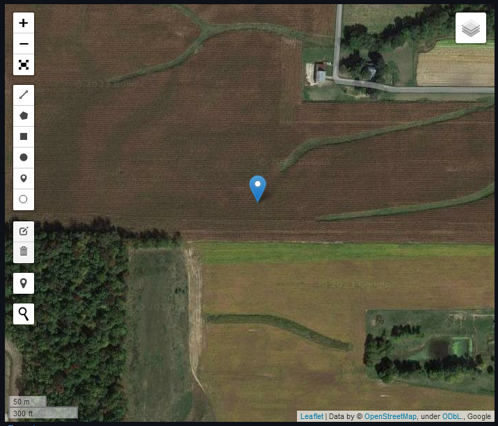
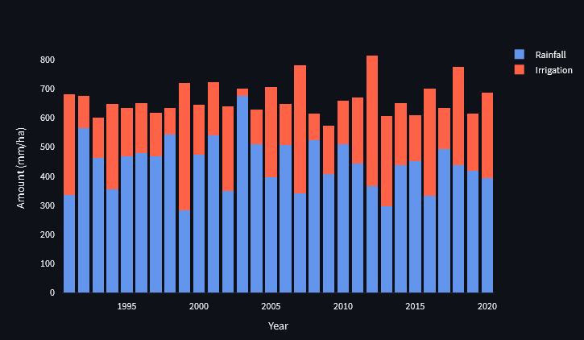
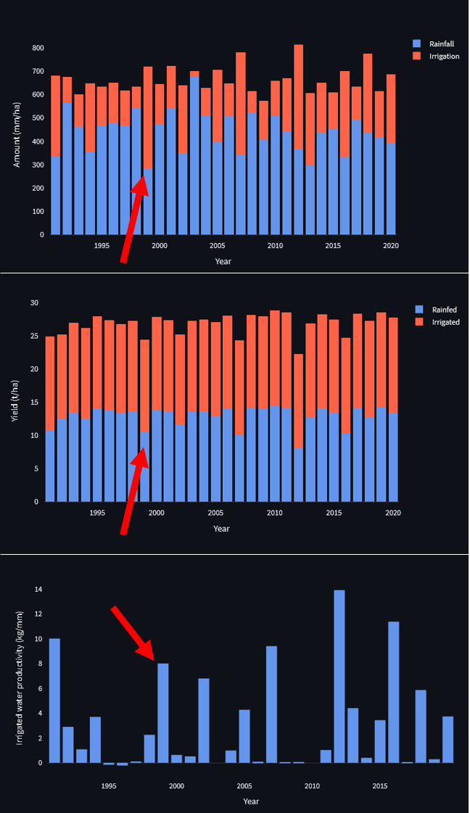
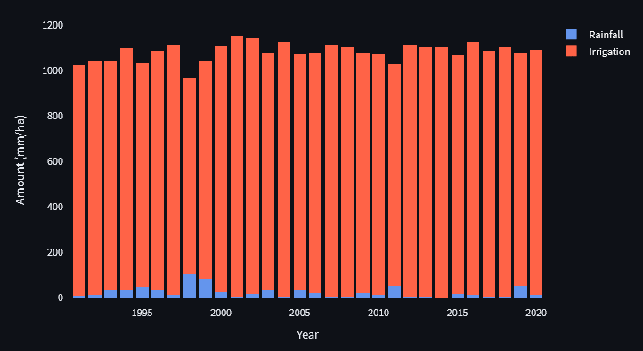
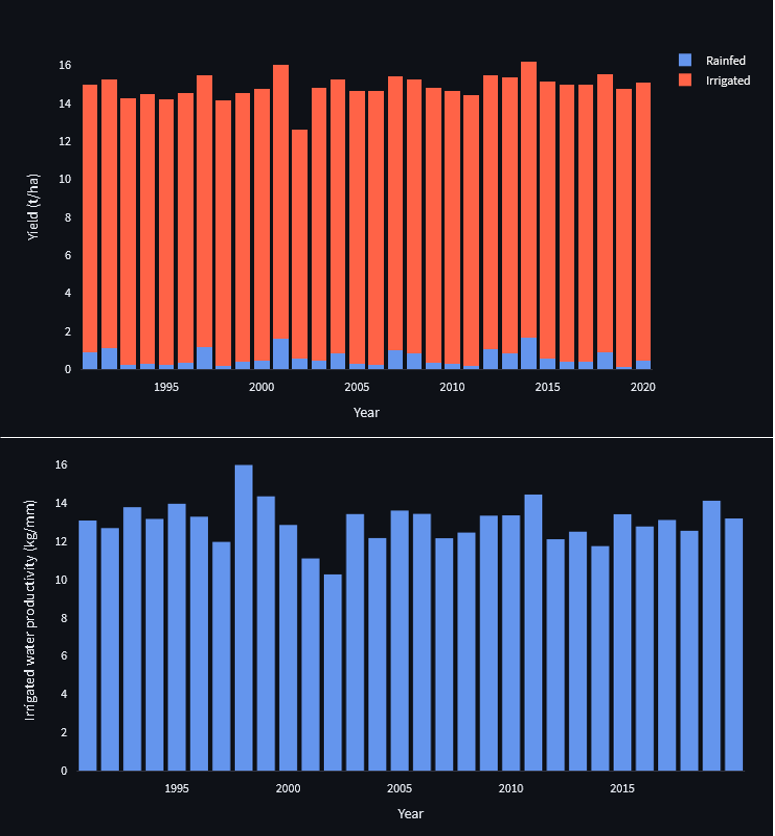
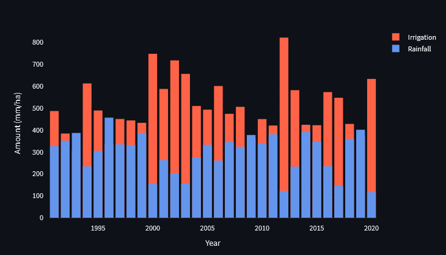
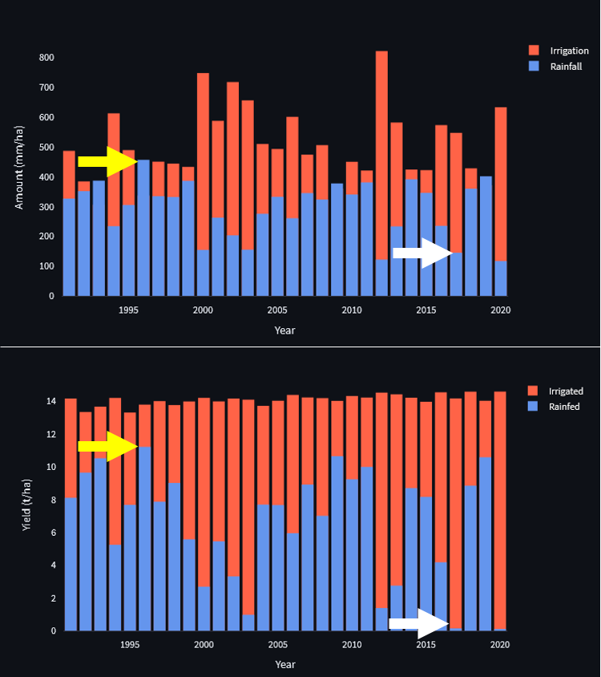
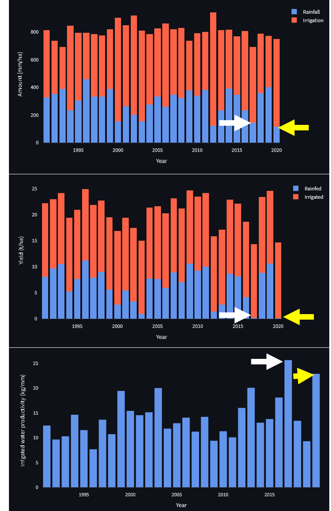

```{r setup, include=FALSE}
knitr::opts_chunk$set(echo = TRUE)
```

\

Irrigation plays a critical role in enhancing agricultural productivity and supporting drought resilience. In this exercise, you will use the AquaPlan app to explore how the value and benefits derived from irrigation varies between different locations and over time. You will assess the yield benefits and water requirements for irrigated maize production in three locations across the United States (Indiana, California, and Nebraska), which vary in terms of the amount and variability of rainfall received during the maize growing season (May to September). You will demonstrate the value of irrigation as a means of both increasing crop yields in areas with insufficient rainfall, and reducing drought risk exposure in agricultural production regions where rainfall levels vary substantially from one year to another. 

\

# Site 1 - Richmond, Indiana

## Select a field
Start by investigating the eastern corn belt of the United States, a region where the majority of agriculture is currently rainfed. Begin by launching AquaPlan ('Launch App' button at the top-right of this page) and navigating to the 'Value of Irrigation' tab. Then, enter the following coordinates (39.909609, -84.900238) in the search box to locate an example field in the vicinity of Richmond. Note, you will then need to use a marker to select a point in the field as shown on the map below. AquaPlan will automatically retrieve weather data for the site from the Daymet gridded weather dataset produced by Oak Ridge National Laboratory in the United States along with soil properties from the global SoilGrids dataset produced by the International Soil Reference and Information Centre (ISRIC).

\

```{r echo=FALSE, out.width='100%'}

```

\

## Setup and run AquaCrop
Select the 'Run AquaCrop' tab and browse through all of the model parameters that can be tweaked. Leave all parameters as their default values for now, but pay particular attention to the 'Irrigation' tab. This tab is where you adjust parameters of your irrigation system, including the application efficiency, maximum application rate or capacity of your irrigation system, and the levels of soil moisture (\% of soil water holding capacity) at which irrigation will be triggered in each of the crop's four main growth stages. Click the 'Run model' button to execute the model using the default set of parameters and geospatial weather and soil input data.

\

:::: {.whitebox .question data-latex="{question}"}
**Question**

How would you expect the yield and irrigation usage to change if you increased/decreased the SMT level at which irrigation is triggered? What about if you used higher/lower SMT values for specific crop growth stages?
::::

\

<!-- could add breakdown of each slider/parameter set here? -->

## Visualise and interpret outputs
Navigate to the 'Visualize outputs' tab, and use the checkboxes to explore the outputs of the AquaPlan simulations for the site in Indiana. Using these plots, try to answer the following questions.

\

:::: {.whitebox .question data-latex="{question}"}
**Question 1.a.**

Using the 'total rainfed and irrigation' plot, how does the amount of rainfall and irrigation water use vary across the 30-year (1991-2020) simulation period? Is the amount of irrigation generally greater or less than the amount of rainfall received by the crop?

<button class="btn btn-primary" data-toggle="collapse" data-target="#BlockName"> Show/Hide Example </button>  
  <div id="Block1" class="collapse">  
  
  Irrigation is generally less than the rainfall received by the crop. However, in years with particularly low rainfall, a greater amount of irrigation is used to meet maize's water demands.
    
  ```{r echo=FALSE, out.width='100%'}
  
  ```
  
  </div>

::::

\

:::: {.whitebox .question data-latex="{question}"}
**Question 1.b.**

Now looking at the 'rainfed vs irrigated yield' and 'irrigation water productivity' plots, do you think that rainfall in your selected site in the eastern corn belt is generally sufficient to meet the water requirements of maize in the majority of years?

<button class="btn btn-primary" data-toggle="collapse" data-target="#BlockName"> Show/Hide Example </button>  
  <div id="Block2" class="collapse">  
  
  Generally, rainfall is sufficient for maize's water demands in Richmond, Indiana. This can be seen by the similar levels of yield for rainfed and irrigated maize in most years. Also, yields remain relatively stable due to consistent rainfall each year. The spikes in irrigation water productivity represent occassional low rainfall years (e.g. 1999), where irrigation was required to meet maize's water demands. 
    
  ```{r echo=FALSE, out.width='100%'}

  ```
  
  </div>

::::

\

**Use the shortcut 'Windows key + Shift + S' to take a screenshot of these three plots for later reference.**

\


# Site 2 - Los Banos, California
## Select a field and re-run AquaCrop
We'll now run the model for a different location in the US. Return to the 'Select region' tab, refresh the page and select a field in the Central Valley of California near to the town of Los Banos by entering the following coordinates (37.174492, -120.347741) in the search box of the map as shown below.  

<!-- Tips no longer required with new refresh step: Note that the place marker for the first site will still be shown on the map, but the model will only use the last point created for simulations. When you return to the 'Select region' tab, your view will also be zoomed in very far, either scroll down or use the '-' button on the map to zoom out. -->
<!-- Map disappears when switching tabs, can't find a solution to this apart from refreshing page, not sure what function is responsible for the map disappearing -->

```{r echo=FALSE, out.width='100%'}
knitr::include_graphics('imgs/tut_1_D.png')
```

\ 

As in the first site, go to the 'Run AquaCrop' tab and run the model again for the newly selected field in California. Keep all of the parameters at the same default values. 

\

## Visualise and compare outputs
Use the checkboxes on the 'Visualize outputs' tab to answer the following questions.

\

:::: {.whitebox .question data-latex="{question}"}
**Question 2.a.**

Using the 'total rainfed and irrigation' plot, how does the amount of rainfall and irrigation water use vary across the 30-year (1991-2020) simulation period? What differences do you notice between this plot and the plot from the eastern corn belt in the first task?

<button class="btn btn-primary" data-toggle="collapse" data-target="#BlockName"> Show/Hide Example </button>  
  <div id="Block3" class="collapse">  
  
  There is far greater irrigation than rainfall for every year, due to the extremely low rainfall of central California. This represents the opposite rainfall scenario to the plot from the eastern corn belt.
    
  ```{r echo=FALSE, out.width='100%'}

  ```
  
  </div>

::::


:::: {.whitebox .question data-latex="{question}"}
**Question 2.b.**

Looking at the 'rainfed vs irrigated yield' plot, is rainfed maize production likely to be viable in this site in Central California and, if so, in which years? How does the difference between rainfed and irrigated yields compare to what you observed previously for the site in Indiana?

<button class="btn btn-primary" data-toggle="collapse" data-target="#BlockName"> Show/Hide Example </button>  
  <div id="Block4" class="collapse">  
  
  Rainfed maize production is inviable across all 30 years simulated here, with yield never exceeding 2 t/ha compared to irrigated yield consistently exceeding 14 t/ha. This represents a huge difference between rainfed and irrigated yields, a stark contrast to the Indiana site where irrigation resulted in little to no increase in yield. 
  
  The stability of yields in California are high due to the consistent use of irrigation. The stability of yields in Indiana are similarly high, but are instead due to consistent rainfall.
    
  ```{r echo=FALSE, out.width='100%'}

  ```
  
  </div>

::::

\

# Site 3 - Imperial, Nebraska

## Select field and re-run model
In the final part of this exercise, we will re-run AquaCrop to simulate maize yields and irrigation requirements for a third location - this time in Imperial, Nebraska in the central United States. Enter the following coordinates (40.499672, -101.686346) into the search box and re-run the model again using the default parameters. 

```{r echo=FALSE, out.width='100%'}
knitr::include_graphics('imgs/tut_1_G.png')
```

\

## Visualise and compare outputs

Use the outputs for the new simulation for the site in Nebraska, along with the screenshots you previously saved, to answer the following questions.

:::: {.whitebox .question data-latex="{question}"}
**Question 3.a.**

How does the amount and variability of rainfall differ in southwestern Nebraska compared to that of the site in central California and the site in Indiana the eastern corn belt?   

<button class="btn btn-primary" data-toggle="collapse" data-target="#BlockName"> Show/Hide Example </button>  
  <div id="Block5" class="collapse">  
  
  Whereas the sites in California (dry) and Indiana (wet) represented extreme annual rainfall patterns, the rainfall at the Nebraska site shows greater inter-annual variation, i.e. some years receive similar levels of rainfall to Indiana, but some years receive very little rainfall.
    
  ```{r echo=FALSE, out.width='100%'}

  ```
  
  </div>

::::


:::: {.whitebox .question data-latex="{question}"}
**Question 3.b.**

How does the inter-annual variability in seasonal rainfall that you identified in the previous question affect the amount of irrigation that is used by the farmer and the yield benefits of irrigation? In which years are the benefits of irrigation highest and lowest? 

<button class="btn btn-primary" data-toggle="collapse" data-target="#BlockName"> Show/Hide Example </button>  
  <div id="Block6" class="collapse">  
  
  Years with lower rainfall require the farmer to use a greater amount of irrigation to meet maize's water demands (e.g. 2012 and 2013). In low rainfall years there is a deficit in the water requirements of maize. Thus, the yield benefits of irrigation are higher in low rainfall years. Irrigation benefit is highest in 2017 (one of lowest rainfall years, white arrows) and lowest in 1996 (highest rainfall year, yellow arrows).
    
  ```{r echo=FALSE, out.width='100%'}

  ```
  
  </div>

::::


:::: {.whitebox .question data-latex="{question}"}
**Question 3.c.**

Which years have the highest levels of irrigation water productivity? Can you use differences in rainfall and irrigation requirements to explain why the productivity of irrigation is greatest in those years?

<button class="btn btn-primary" data-toggle="collapse" data-target="#BlockName"> Show/Hide Example </button>  
  <div id="Block7" class="collapse">  
  
  Irrigation water productivity was highest in 2017 (white arrows) and 2020 (yellow arrows). These years are both amongst the lowest rainfall years of the 30-year period, as shown by the top plot. Specifically, rainfed maize was inviable in both of these years, as shown by the middle plot. The inviability of rainfed maize means that there is the greatest difference between rainfed and irrigated yields for 2017 and 2022. Thus, the productivity of irrigation is greatest in these years.
    
  ```{r echo=FALSE, out.width='100%'}

  ```
  
  </div>

::::
